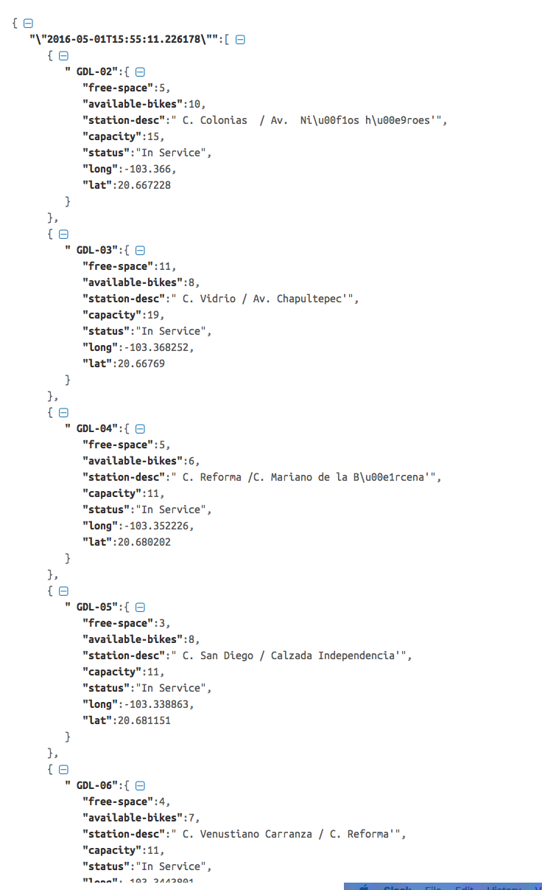

#Mi Bici Tools

Web scraper para el servicio de mi bici de la ZMG (Zona Metropolitana de Guadalajara).

##Requerimientos

* Python 3+
* [Beautiful Soup] (https://www.crummy.com/software/BeautifulSoup/)

Por ahora puede obtener (manualmente) los datos en tiempo real de todas las cicloestaciones.
**Para ello hay que correr en la línea de comando:** `$python3 mb-scraper.py`

El resultado actual:

### Trabajando en una visualización de movimiento de bicicletas

